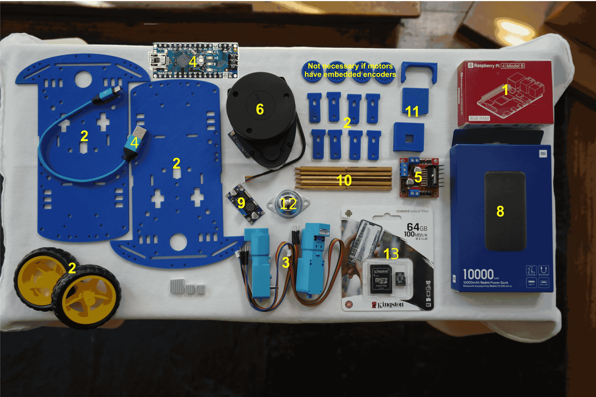

Bill of materials
=================

Materials
---------

.. list-table:: Bill of Materials
   :header-rows: 1

   * - Number
     - Module
     - Part
     - Links
     - Comments
   * - 1
     - SBC
     - Raspberry Pi 4 B (4 Gb)
     - `PiShop <https://www.pishop.us/product/raspberry-pi-4-model-b-2gb/>`__, `TiendaTec <https://www.tiendatec.es/raspberry-pi/gama-raspberry-pi/1100-raspberry-pi-4-modelo-b-4gb-5056561800349.html>`__
     - If you want better performance you could buy the 8GB model
   * - 2
     - Chassis
     - 2 x Print 3d Chassis + Rubber Tyre Wheels
     - `Chassis <https://github.com/Ekumen-OS/andino/tree/humble/andino_hardware/printing_model/chassis>`__, `Wheels Sparkfun <https://www.sparkfun.com/products/13259>`__
     -
   * - 3
     - Motors
     - 2 x Motor with Encoder
     - `Sparkfun <https://www.sparkfun.com/products/16413>`__
     -
   * - 4
     - Microcontroller
     - Arduino Nano
     - `Amazon <https://www.amazon.es/RUIZHI-Interfaz-Controlador-Mejorada-Compatible/dp/B0CNGKG4MZ/ref=sr_1_6?dib=eyJ2IjoiMSJ9.gnHfW9VtlEjMns12dAyHXLyFAlaikWpFyoOQJpO0iJBR-zelggQTQ9n001SH_P6NQ9DO3gPetP2krm7GAGvJus6vz4Utqu8Hy1gol0Rq7nmtJITd70ZNi3linf9v1g1iP7MlBx98cBGLVvFy-O2kZnJ63uZDwOZzwz_kExJzUWAxroO3AjufqqGOQHswLfDfjH6jpOJt54xxpCaqurDccId2O0uGKOj6WpPz6iLSubpsPB479SWYPSncxWQzz2kO4VjT6HVzPS2uWi19TS-A9WXVZceLBiz9t25Pf39jiGQ.1sLxrQ94HdIoXBq4VcDFMZhzKoL3wyJoY-U6BmDI6fY&dib_tag=se&keywords=arduino+nano+v3&qid=1714468231&sr=8-6>`__
     - You can also use an Arduino Uno, but mind size. It should include a microUSB - USB cable. If not, you will need to purchase it.
   * - 5
     - Motor Driver
     - L298N Dual H Bridge
     - `Amazon <https://www.amazon.com/Bridge-Stepper-Driver-Module-Controller/dp/B09T6K9RFZ/ref=sr_1_4?crid=37YY7JO6C3WVE&keywords=l298&qid=1685740618&sprefix=l29%2Caps%2C277&sr=8-4>`__
     -
   * - 6
     - Laser Scanner
     - RPLidar A1M8
     - `RobotShop <https://www.robotshop.com/products/rplidar-a1m8-360-degree-laser-scanner-development-kit?_pos=3&_sid=b0aefcea1&_ss=r>`__, `Amazon <https://www.amazon.es/dp/B07VLFGT27?ref_=cm_sw_r_cso_wa_apan_dp_RJ3AZC2XCEVDK0X2DCGA&starsLeft=1&th=1>`__
     - If no microUSB-USB cable is included, you will need to purchase one
   * - 7
     - Camera
     - Raspi Camera Module V2, 8 MP
     - `Robotshop <https://www.robotshop.com/products/raspberry-pi-camera-module-v2>`__, `Amazon <https://www.amazon.com/Raspberry-Pi-Camera-Module-Megapixel/dp/B01ER2SKFS?th=1>`__, `Longer cable <https://www.amazon.es/AZDelivery-Repuesto-Raspberry-30cm-Flexkabel/dp/B01NAXKTDP/ref=sr_1_9?__mk_es_ES=%C3%85M%C3%85%C5%BD%C3%95%C3%91&crid=I1IK0FQVQCCU&dib=eyJ2IjoiMSJ9.2UYb-3a8M00iHZZiHT0xjp8vfzq-3BSmJSLxdtcCMV6WMj8g5T8T_j5DKX8cESxqnVN01YpV3nX28IuhewGTOsmJ4yF5st20TxU7kHNHftZE_aygB5vT-001wEvUfx70V0H0DZljw0YfC4R2wpjsTR_89pAA95C4F8LhJiGbbUGTEjBgmjnsRIFs6FYatZa9KVusNyv2cKxGZlav36gdoAkMXQUvX578c6frxSnH5DROCeK6bKSqrczA7R8OBVWC995fK1AxHbJLHZJEDQGXMVhUkHd2liBV0nq48mnyE6Q.nHty4TxSpldkH8FZAia_rx7sX6c2uIBpPRUEqwq5NiY&dib_tag=se&keywords=raspberry%2Bpi%2Bcamera%2Bcable&qid=1716878948&sprefix=raspberry%2Bpi%2Bcamera%2Bcable%2Caps%2C76&sr=8-9&th=1>`__
     - A link for a longer cable (30 cm) is included, just in case the one included with the camera is too short.
   * - 8
     - Electrical Power Supply
     - Powerbank 5V
     - `Amazon <https://www.amazon.es/Heganus-Powerbank-10000mAh-port%C3%A1til-pr%C3%A1ctico/dp/B082PPPWXY/ref=asc_df_B082PPPWXY/?tag=googshopes-21&linkCode=df0&hvadid=420334509253&hvpos=&hvnetw=g&hvrand=13392500367381615369&hvpone=&hvptwo=&hvqmt=&hvdev=c&hvdvcmdl=&hvlocint=&hvlocphy=9181150&hvtargid=pla-878722533582&psc=1&mcid=642b7553488f350a8726c7bfb183a667&tag=&ref=&adgrpid=95757266066&hvpone=&hvptwo=&hvadid=420334509253&hvpos=&hvnetw=g&hvrand=13392500367381615369&hvqmt=&hvdev=c&hvdvcmdl=&hvlocint=&hvlocphy=9181150&hvtargid=pla-878722533582>`__
     - Any powerbank is suitable: Mind size / weight / output current(>=2A)
   * - 9
     - Power Step up
     - DC - DC boost converter
     - `Amazon America <https://www.amazon.com/0-9-Step-Regulator-DC-Converter/dp/B0C6QTJMFN/ref=sr_1_25?crid=G0FHM4SS5TWX&keywords=dc+step+up+converter&qid=1685741155&sprefix=dc+step+up+conver%2Caps%2C371&sr=8-25>`__, `Amazon Europe <https://www.amazon.com/Converter-Adjustable-Voltage-Regulator-Compatible/dp/B089JYBF25/ref=sr_1_3?crid=3EB0RWDAO1UED&dib=eyJ2IjoiMSJ9.OVkOHemqP_yF8PlJmBNcovwOq6TzYQJADN7pCYP7m9hgHNOuzIA3jqIt5kZK9azOh0Nu3D7ucFbFjgBJprKpAQsC1VhKtCS1z6QLs6w0Ht4seE97e8yWkUkP6fPOry_5D1nyfsh0aMc7wLknNr5R9yDWTg6cYralThbLeU8qfIcpq5m66m9luKznRZiv2eUaXvI0rmcQyLKR2Z5NO_xktttAXuvHAnEnBwpk_3LZ1xA.r84ipJcrFDbcftUpaU9uN4sRufhsUq4Ny_2znQEqdPU2&dib_tag=se&keywords=dc%2Bstep%2Bup%2Bconverter&qid=1717628623&sprefix=dc%2Bstep%2Bup%2Bconverter%2Caps%2C154&sr=8-3&th=1>`__
     -
   * - 10
     - Fixing & Mount
     - M3 bolts/fasteners - M3 Spacers - M2.5/2.0 bolts/fasteners for SBC
     - `Mercado Libre <https://articulo.mercadolibre.com.ar/MLA-823234605-kit-tornillos-electronica-500-unid-fresada-philips-m3-oferta-_JM#position=1&search_layout=stack&type=item&tracking_id=2a14497e-a3dc-4a0f-98fb-b3b524117284>`__, `Amazon <https://www.amazon.com/Taiss-620PCS-Metric-Assortment-Washers/dp/B0CWXRG6VL/ref=sr_1_2_sspa?crid=3R3BT7LOQWZ4B&dib=eyJ2IjoiMSJ9.EBY3VtTnCGRri20ECsEwpF2eTrWOhlADXq8Rbv78LP7JVW0giUfPQ5-G3e5cVq7svNoKIPbFGf0jQoImIPuJvU72yWC0XaaXyHE03TjX1zVT-AxcCUr6bvvqnQrrwFNowZjHy2ZibnHX4sDMx3aixEmx5XUGq43KVEID5FIGzTw6xsLQd410DewktxUFWCHLSD8HR8BeAUKcP3mzciuPmc8dcz9TzY5cZ_wYFO-WyEQ.B5-OkrGZbzkIn8cw4Zb_LtQUoxX1qKuiVqI6PTNmpZk&dib_tag=se&keywords=kit+M3+tuercas+y+tornillos&qid=1714469030&sprefix=kit+m3+tuercas+y+tornillos%2Caps%2C149&sr=8-2-spons&sp_csd=d2lkZ2V0TmFtZT1zcF9hdGY&psc=1>`__, `Spacers <https://www.amazon.es/YOKIVE-Separadores-Tornillos-Hexagonal-Consistente/dp/B0BWXL75R6/ref=sr_1_11?__mk_es_ES=%C3%85M%C3%85%C5%BD%C3%95%C3%91&crid=39R5HOTYH2AC9&dib=eyJ2IjoiMSJ9.7A-mx6__B2agU-KSbpRPhlNj2WkQfkj8OtZKEmwlwHa3NiDqUA-1Um0339r3Ssad0h03L471s08VcgBGByJpKwummUR8Sgyt3AuF4sahKIacNlyBlD8mcl3bNQ54HR8L585aepoUOxllFXUi2AEGde8kjkNqaiOEcyflppOf1eKtAtlyTYnnjOVJs5YqRK97QV3pUt1g8Rt1zLn7RsEtRrvlMQIXXBjIFFZsqK2tN7OBY2lgorgdRsXP1aS5tad9rD9vsl9SkPUx_c1Bf0ulzabNSFk19v_cSd0IwEx2zSw.30hsx31Q_-5A3eLrlOwhoTvAs_yDufCk04NiN0xk0C8&dib_tag=se&keywords=spacer+30mm+m3&qid=1716156793&refinements=p_n_free_shipping_eligible%3A20930980031&rnid=20930979031&sprefix=spacer+30mm+m3%2Caps%2C107&sr=8-11>`__
     - You will probably need to replace the default spacers for the LiDAR with M3 spacers
   * - 11
     - Other 3D printed parts
     - Camera Mount
     - `3D models <https://github.com/Ekumen-OS/andino/tree/humble/andino_hardware/printing_model/raspi_cam_mount>`__
     - These parts are for fixing the Raspi Cam at the front of the robot
   * - 12
     - Caster wheel
     - Caster wheel
     - `Amazon <https://www.amazon.es/Unidades-Peque%C3%B1as-Dispositivo-Transferencia-Transporte/dp/B098XHYW7F/ref=asc_df_B098XHYW7F/?tag=googshopes-21&linkCode=df0&hvadid=529604577974&hvpos=&hvnetw=g&hvrand=15132275207682237467&hvpone=&hvptwo=&hvqmt=&hvdev=c&hvdvcmdl=&hvlocint=&hvlocphy=9181150&hvtargid=pla-1396749454795&psc=1&mcid=b1df85a65d163e89b507de60e73f9e65>`__
     -
   * - 13
     - SD Card
     - 64 GB SD Card
     - `Apokin <https://www.apokin.es/tarjeta-microsd-philips-64gb-class10.html>`__, `Amazon <https://www.amazon.es/Kingston-Tarjeta-SDCS2-64GB-Adaptador/dp/B07YGZQ4H8/ref=sr_1_7?dib=eyJ2IjoiMSJ9.zE4PI6DCNK3d78rtl5ga1NQXGwJT1jC2iqi3mXNzbdJ4BosAUPCn9gc13Gc7pdHDx-7wTy4CDj0zIlgDpu9qXH-6GLgI--pJbfi3OvTBPhwwH-tfi1OzM9xqcAOJG6pJuTtkknsyFk6Ma2EHJ4UdheaziDC_KKaWNKgsf_DFbcA-ZxQSXlTtQqwHvCzgi8hq4vKGiEIY-LSZS_sXE9IUGroo0Isl59Po2IXhTBG5IHnnsVR_7lo0dVBVFYl-5GY2CvJbrixULuPl90TbFTTP6DoIeDcpFdDTcbvSK3Lecss.WXBgIZllFgQxx13Szl3q6WIlTOliwrN8V42J1SzNJ8o&dib_tag=se&qid=1714552555&refinements=p_n_feature_browse-bin%3A948155031&s=computers&sr=1-7>`__
     - The SD Card is used to host the OS for the Raspberry Pi
   * - 14
     - (Optional) Plastic seals
     -
     -
     - You will need at least 2 longer ones to fix the powerbank to the upper chassis, and the shorter ones for all the wires. If you don't want to use them, you can use other method to fix the powerbank and wires

When you gather all the parts, you should have the following (*NOTE: the printed encoder wheels are no longer necessary, since the motors are equipped with an embedded encoder*):

Tooling
-------

.. list-table::
   :header-rows: 1

   * - Number
     - Tool
     - Links
     - Comments
   * - 1
     - Set of screwdrivers
     - `Amazon <https://www.amazon.es/Ainiv-Destornilladores-Precisi%C3%B3n-Destornillador-magnetizador/dp/B09CD1F44B/ref=asc_df_B09CD1XT57/?tag=googshopes-21&linkCode=df0&hvadid=529495276761&hvpos=&hvnetw=g&hvrand=2854754490438163902&hvpone=&hvptwo=&hvqmt=&hvdev=c&hvdvcmdl=&hvlocint=&hvlocphy=9181160&hvtargid=pla-1431590275356&mcid=4f49c0c6c8ca33b390169090ae4ad15b&th=1>`__
     - You need flat and star screwdrivers
   * - 2
     - Soldering iron
     - `Amazon <https://www.amazon.es/VFANDV-Electrico-Temperatura-Ajustable-Diversamente/dp/B0CR14H2V2/ref=asc_df_B0CR14H2V2/?tag=googshopes-21&linkCode=df0&hvadid=689229847163&hvpos=&hvnetw=g&hvrand=4753947158683483083&hvpone=&hvptwo=&hvqmt=&hvdev=c&hvdvcmdl=&hvlocint=&hvlocphy=9181160&hvtargid=pla-2294176442108&psc=1&mcid=f96659ffb598337692486b3f12af371d&gad_source=1>`__
     -
   * - 3
     - Silicon Pistol
     - `Amazon <https://www.amazon.es/Tilswall-Pegamento-Manualidades-Bricolaje-Reparaciones/dp/B07TD1RD4R/ref=pd_ci_mcx_pspc_dp_d_2_i_1?pd_rd_w=49k0d&content-id=amzn1.sym.f11fe75a-7397-412e-9b90-7e09bf6f5c14&pf_rd_p=f11fe75a-7397-412e-9b90-7e09bf6f5c14&pf_rd_r=MA73TQJTYS2GMC7XW7YC&pd_rd_wg=Z3aRz&pd_rd_r=08e805c6-81b7-4023-8ea1-9b357536cba1&pd_rd_i=B07TD1RD4R&th=1>`__
     - This pistol should include 75 silicon bars so you won't need to purchase them separately
