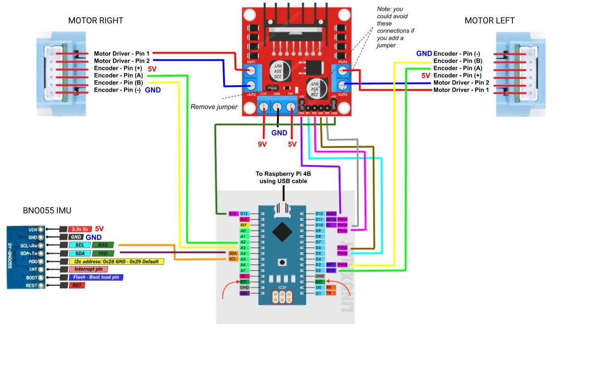
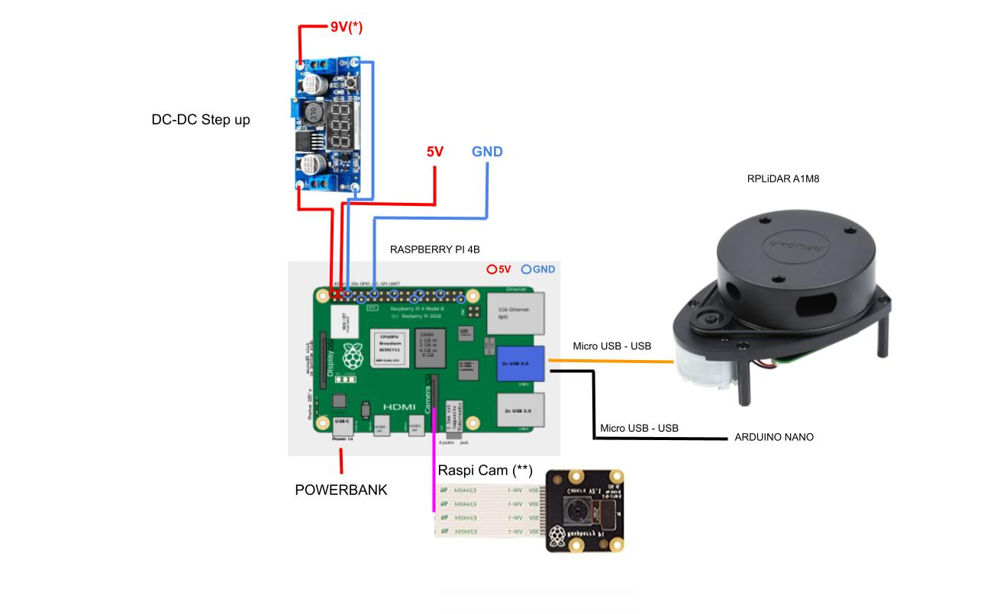

Connections Diagram
===================

Motor-Arduino
-------------

Some frequent errors:
 - If one of the motors rotates in the opposite direction (think about the orientation of the motors in the chassis) probably the output(+ and -) of the L298N's output should be toggled.
 - When moving forward the encoder values should increase while moving backwards they should decrease. If it is happening the other way around probably the A and B encoder signals should be toggled.

Raspberry-Power
---------------

\* NOTE: depending on the power bank maximum output current, the motors may need to be powered with a voltage value lower than 9V. While a higher voltage value (up to 9V) leads to smoother operation (better motor speed control), it also increases their open-loop speed, which is noticeable particularly during motion start and varies according to the power bank quality (output current capabilities). Therefore, adjusting the output voltage to lower values (around 7V) may be required so as to make the motors work as expected.

** NOTE: Ensure the ribbon cable is properly connected with the blue or silver side facing the USB ports.
