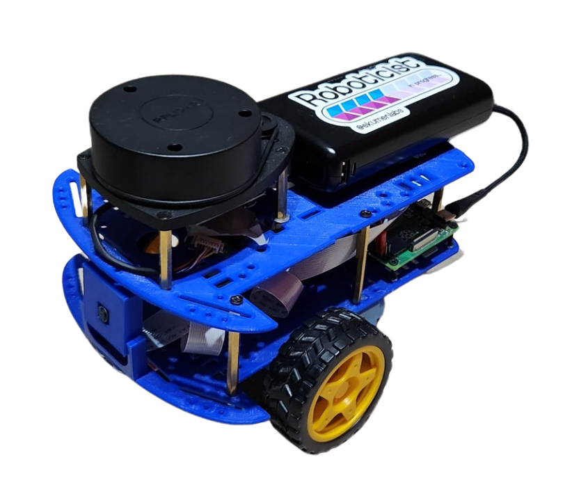

.. image:: ./media/logo_black.svg
   :align: center

Andino
======

Andino is a fully open-source diff drive robot designed for educational purposes and low-cost applications.
It is fully integrated with ROS 2 and it is a great base platform to improve skills over the robotics field.
With its open-source design, anyone can modify and customize the robot to suit their specific needs.

Note: For videos go to :ref:`Media <media>` section.

Getting Started
--------------

.. toctree::
   :maxdepth: 1

   md/bill_of_materials.md
   md/connections_diagram.md
   md/assembly_process.md
   md/first_steps.md

.. TODO All of this can be extracted from 'andino_hardware/README.md'

Package Summary
---------------

.. toctree::
   :maxdepth: 1

   md/andino_bringup.md
   md/andino_hardware.md
   md/andino_description.md
   md/andino_firmware.md
   md/andino_base.md
   md/andino_control.md
   md/andino_gz_classic.md
   md/andino_slam.md
   md/andino_navigation.md
   md/andino_apps.md

.. TODO Find a way to move the README of the packages so they can be accesible from here

Installation
------------

.. toctree::
   :maxdepth: 1

   md/installation.md

Usage
-----

.. toctree::
   :maxdepth: 1

   md/usage.md

.. _media:

Media
-----

RVIZ Visualization
^^^^^^^^^^^^^^^^^^

.. video:: ./media/andino_wheel_tf.mp4
   :width: 640
   :height: 480

Slam
^^^^
.. TODO add the videos and compress them

Using the robot for mapping.

.. video:: ./media/
   :width: 640
   :height: 480

.. video:: ./media/
   :width: 640
   :height: 480

See :doc:`andino slam <md/andino_slam>` for more information.

Related projects
----------------

Other projects built upon Andino!

- `andino_gz <https://github.com/Ekumen-OS/andino_gz>`_: `Gazebo <https://gazebosim.org/home>`_ (non-classic) simulation of the andino robot.
- `andino_webots <https://github.com/Ekumen-OS/andino_webots>`_: `Webots <https://github.com/cyberbotics/webots>`_ simulation of the Andino robot fully integrated with ROS 2.
- `andino_o3de <https://github.com/Ekumen-OS/andino_o3de>`_: `O3DE <https://o3de.org/>`_ simulation of the Andino robot.
- `andino_isaac <https://github.com/Ekumen-OS/andino_isaac>`_: `Isaac Sim <https://docs.omniverse.nvidia.com/isaacsim/latest/index.html>`_ simulation of the Andino robot.
- `andino_integration_tests <https://github.com/Ekumen-OS/andino_integration_tests>`_: Extension to the Andino robot showing how to build integration tests.

Share your Andino!
------------------

Have you built your `Andino` already? Please go to `Show & Tell <https://github.com/Ekumen-OS/andino/discussions/categories/show-and-tell>`__ Discussion and share with us your own version of it.

Inspirational sources
---------------------

This section is dedicated to recognizing and expressing gratitude to the open-source repositories that have served as a source of inspiration for this project. We highly recommend exploring these repositories for further inspiration and learning.

- `articubot_one <https://github.com/joshnewans/articubot_one>`_
- `diffbot <https://github.com/ros-mobile-robots/diffbot>`_
- `noah_hardware <https://github.com/GonzaCerv/noah-hardware>`_
- `linorobot <https://github.com/linorobot/linorobot2>`_

Contributing
------------

Issues or PRs are always welcome! Please refer to `CONTRIBUTING <CONTRIBUTING.md>`_ doc.

Code development
----------------

Note that a `Docker <https://github.com/Ekumen-OS/andino/tree/humble/docker>`_ folder is provided for easy setting up the workspace.
