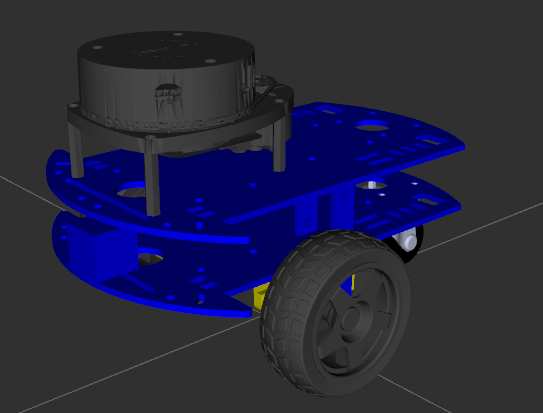

andino_description
==================

Description
-----------

This package holds the URDF description of the robot.

In the ``urdf`` folder you have the URDF files that contain the description of the robot, divided into different modules and merged into ``andino.urdf.xacro`` file.

Configuration
-------------

In case you want to change the physical properties of some of the components of the robot, you can do it by modifying the default YAML files inside the ``config/andino`` folder.

You can even add your own configuration files in another directory in the ``config`` folder, and pass this directory to the main file using the ``yaml_config_dir`` xacro argument on the launch files.

Launch Files
------------

For launching robot state publisher for filling up static tf information and serving the description of the robot. Typically used during robot bringup.

.. code-block:: bash

  ros2 launch andino_description andino_description.launch.py

For launching the robot state publisher and providing some visualization with rviz to analyze the robot description.

.. code-block:: bash

  ros2 launch andino_description view_andino.launch.py
